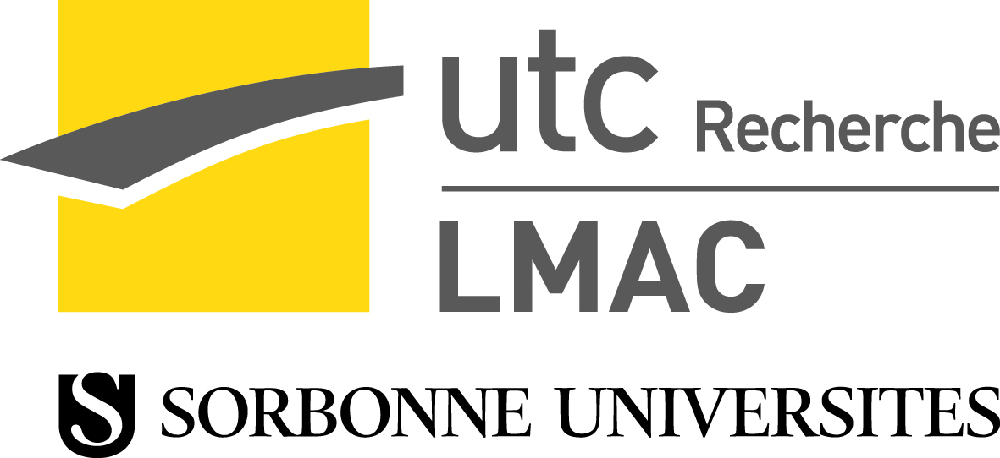

## En quelques mots ...

Chaque vendredi, entre 14 et 15h, est organisé le séminaire doctorants du LMAC, dans ses locaux.
C'est l'occasion d'échanger sur ses thématiques de recherche, ainsi que de s'entraîner, pour l'orateur, à présenter ses travaux.

----

## Calendrier et abstract des présentations à venir

### Calendrier

[calendrier](calendar)

### Abstract

#### Décembre 2017
- [Abstract du 03 nov. 2017 - Statistique Bayésienne](abstract/20171201_abstract_BayesAppoach.pdf)

#### Novembre 2017

- [Abstract du 03 nov. 2017 - Boutheina NEMOUCHI](abstract/abstract2.pdf)
- [Abstract du 10 nov. 2017 - Wang GAO](abstract/20171110_abstract_WangGAO)
- [Abstract du 17 nov. 2017 - Ivan Rukavina](abstract/abstract.pdf)
- [Abstract du 24 nov. 2017 - Rekia Meriem Ahmed Bacha](abstract/abstract-meriem.pdf)

## Autres liens ...

[A propos](about)

[Contact](mailto:fridayseminar.lmac@gmail.com)
